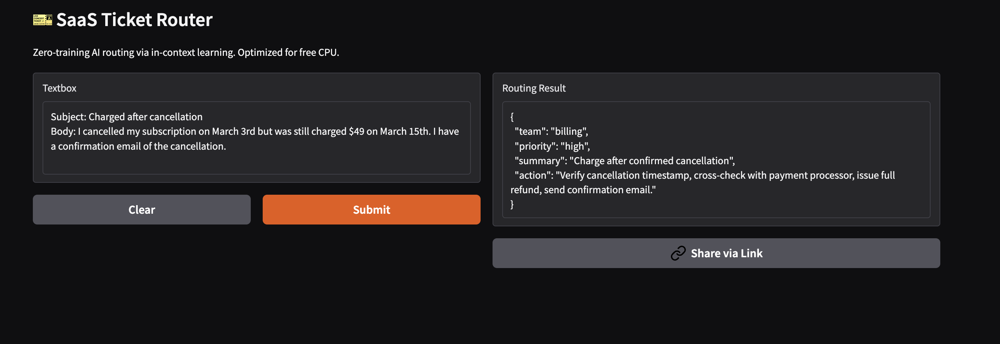

# 🎫 SaaS Ticket Router (Few-Shot In-Context Learning)

A lightweight, zero-training AI agent that routes customer support tickets to internal teams using **in-context learning**. Optimized for free-tier cloud deployment with native C++ inference, INT4 quantization, and dynamic data loading.

🔗 **[Live Demo](https://ashiquzzaman-saas-ticket-router.hf.space/)**  

## 📸 Preview


---

## ✨ Features

- ✅ **Zero Fine-Tuning** – Uses few-shot in-context learning instead of weight updates
- ✅ **CPU-Optimized Inference** – `llama-cpp-python` + GGUF Q4_K_M quantization (~1.1GB)
- ✅ **Dynamic Data Loading** – Edit `tickets.jsonl` → Space auto-updates in ~60s
- ✅ **Structured JSON Output** – Robust regex extraction + fallback parsing
- ✅ **Auto-Deploy Pipeline** – GitHub commit → HF Spaces rebuild → Live URL updates
- ✅ **Free Tier Ready** – Runs on HF free CPU (~3-4s) or free T4 GPU (~1-2s)

---

## 🏗️ Architecture & How It Works

### 🌊 Request Flow

```
[User Input] → Gradio UI
↓
app.py loads tickets.jsonl → builds few-shot prompt (system + examples + query)
↓
llama-cpp C++ backend (INT4 GGUF, KV cache, AVX2 optimizations)
↓
Autoregressive generation (temp=0.1, max_tokens=60)
↓
Regex JSON extraction → validation → return to UI
```


### 🔍 Layer-by-Layer Mechanism

| Layer | Component | How It Works | Why It's Used |
|-------|-----------|--------------|---------------|
| **Data** | `tickets.jsonl` | Line-delimited JSON. Each line: `{"input":"...","output":"..."}` | Stream-friendly, version-controlled, zero parsing overhead. Edit in browser → auto-deploy |
| **Prompt Engineering** | `build_prompt()` | Assembles `system → user/assistant examples → new query` as plain text | Bypasses heavy chat templates. Reduces token count → faster attention computation |
| **Inference Engine** | `llama-cpp-python` | Loads pre-quantized GGUF model. Uses native C++ backend with AVX2/FMA CPU instructions | 2.5-3x faster than PyTorch on free vCPUs. Drops VRAM dependency. INT4 cuts memory by 8x |
| **Generation** | `llm(prompt, max_tokens=60, temp=0.1)` | Autoregressive decoding with KV cache reuse + low temperature | Deterministic routing. Minimizes hallucination & JSON drift |
| **Output Parsing** | `re.search(r'({.*})', raw, re.DOTALL)` | Extracts JSON block, handles markdown/backticks, strips whitespace | Gracefully handles LLM formatting quirks. Returns clean JSON or raw fallback |
| **UI & Hosting** | `Gradio` + `HF Spaces` | Binds `route_ticket()` to web form. HF auto-builds Docker container from GitHub | Zero infra config. Public URL auto-provisioned. Auto-restarts on crash |

---

## 🛠️ Tools & Technologies

| Tool | Role | Version/Format | Why Chosen |
|------|------|----------------|------------|
| `llama-cpp-python` | Inference runtime | `0.2.79+` | Native C++ backend, GGUF support, CPU/GPU auto-detection |
| `Qwen2.5-1.5B-Instruct-GGUF` | Base LLM | `q4_k_m.gguf` (~1.1GB) | Instruction-tuned, strong routing logic, Apache 2.0 license |
| `Gradio` | Web UI framework | `4.40+` | Zero-config frontend, auto-hosted on HF Spaces |
| `Hugging Face Spaces` | Deployment platform | Gradio SDK + Free CPU/GPU | Serverless hosting, auto-CI/CD from GitHub, public URLs |
| `GitHub` | Version control & CI | Public repo | Code hosting, one-click repo linking, automated space rebuilds |
| `JSONL` | Data format | Line-delimited JSON | Lightweight, human-editable, stream-friendly for dynamic loading |

---

## 📁 Project Structure
```
📦 saas-ticket-router
├── 📄 app.py # Core inference, prompt builder, JSON parser, Gradio UI
├── requirements.txt # Runtime dependencies (llama-cpp-python, gradio, huggingface_hub)
├── 📄 tickets.jsonl # Few-shot routing examples (dynamically loaded)
└── 📄 README.md # This documentation
```

---

## 🚀 How to Deploy (Fully Online, Zero Local Setup)

1. **Fork/Clone** this repository
2. Go to [Hugging Face Spaces](https://huggingface.co/new-space)
3. Create Space → SDK: `Gradio` → Hardware: `CPU basic (free)` or `GPU T4 (free)`
4. In `Settings` → `Linked GitHub repositories` → Connect your repo
5. HF automatically clones, installs deps, downloads the ~1.1GB GGUF model, and runs `app.py`
6. **Live URL:** `https://huggingface.co/spaces/your-username/saas-ticket-router`

*First load takes ~15-30s (model download + cold start). Subsequent requests: 3-4s (CPU) or 1-2s (GPU).*

---

## ⚙️ Customization

| Task | How to Do It |
|------|--------------|
| **Add/Update Routing Examples** | Edit `tickets.jsonl` in GitHub → Commit → Space auto-rebuilds |
| **Change Team Categories** | Update the `system` message in `build_prompt()` |
| **Increase Context/Examples** | Modify `EXAMPLES` slice limit (`[:4]`) → trade latency for accuracy |
| **Enable Free GPU** | Space `Settings` → `Hardware` → Select `GPU T4 (free)` → Save |
| **Swap to Stronger Model** | Change `MODEL_REPO` to `Qwen/Qwen2.5-3B-Instruct-GGUF` (still CPU-compatible) |

---

## ⚠️ Free Tier Notes & Optimizations

- **Cold Start:** First visit after 24h inactivity takes ~20-30s to wake up & load model into RAM
- **Rate Limits:** ~100 requests/hour on free CPU. Ideal for demos & portfolios
- **Latency Optimization:** 
  - `n_ctx=768` reduces attention compute
  - `temperature=0.1` + `do_sample=False` ensures deterministic JSON
  - `llama-cpp` C++ backend bypasses Python/GIL overhead
  - Regex parser handles markdown/backticks gracefully
- **Memory Usage:** ~1.2GB RAM for Q4_K_M model. Well within HF's 16GB free limit

---

## 📜 License & Credits

- **License:** MIT
- **Model:** [Qwen2.5-1.5B-Instruct-GGUF](https://huggingface.co/Qwen/Qwen2.5-1.5B-Instruct-GGUF) (Apache 2.0)
- **Frameworks:** [llama.cpp](https://github.com/ggerganov/llama.cpp) | [Gradio](https://gradio.app) | [Hugging Face Spaces](https://huggingface.co/spaces)
- **Built for:** Portfolio demo, SaaS ops workflow exploration, few-shot LLM routing

---
*🔧 Need help extending this? Open an issue, fork the repo, or connect the space to your own ticket pipeline!*
